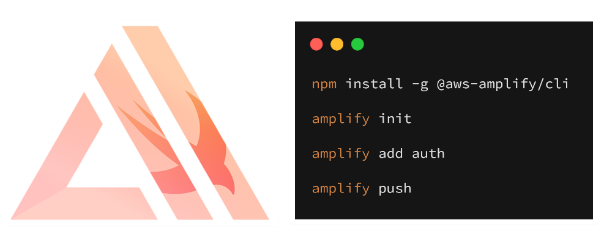

# Building real-time applications with iOS, GraphQL & AWS AppSync

In this workshop we'll learn how to build cloud-enabled native iOS Swift apps with [AWS Amplify](https://aws-amplify.github.io/) and connect our apps to a GraphQL API via AWS AppSync.

We'll start from a new Xcode project, add categories such as `API` and `Auth` using the Amplify Framework to provision cloud resources such as a hosted GraphQL API via AWS AppSync, Amazon DynamoDB as a data source, or an Identity Provider via Amazon Cognito to provide basic authentication. We'll start simple and work our way up to a fully connected mobile app. Please provide any feedback you have in the 'issues' and I'll take a look. Let's get started!



### Topics we'll be covering:

- [GraphQL API with AWS AppSync](https://github.com/wizage/aws-appsync-ios-workshop/tree/SwiftUI#getting-started---create-an-xcode-project)
- [Deleting the resources](https://github.com/wizage/aws-appsync-ios-workshop/tree/SwiftUI#removing-categories-from-amplify-project)


#### Old fashion Swift
- [Using old fashion Swift](https://github.com/wizage/aws-appsync-ios-workshop)

## Getting Started - Create an Xcode project

To get started, create a new Xcode project for iOS SwiftUI & save as: `ios-amplify-app`

From a Mac Terminal, change into the new app directory & prepare to install and congigure the Amplify CLI.

### Install and Configure the Amplify CLI - Just Once

Next, we'll install the AWS Amplify CLI:

```bash
npm install -g @aws-amplify/cli
```

After installation, configure the CLI with your developer credentials:

Note: If you already have the AWS CLI installed and use a named profile, you can skip the `amplify configure` step.
`Amplify configure` is going to have you launch the AWS Management Console, create a new IAM User, asign an IAM Policy, and collect the programmatic credentials to craate a CLI profile that will be used to provision AWS resources for each project in future steps.

```js
amplify configure
```

> If you'd like to see a video walkthrough of this configuration process, click [here](https://www.youtube.com/watch?v=fWbM5DLh25U).

Here we'll walk through the `amplify configure` setup. Once you've signed in to the AWS console, continue:
- Specify the AWS Region: __us-east-1__
- Specify the username of the new IAM user: __amplify-workshop-user__
> In the AWS Console, click __Next: Permissions__, __Next: Tags__, __Next: Review__, & __Create User__ to create the new IAM user. Then, return to the command line & press Enter.
- Enter the access key of the newly created user:   
? accessKeyId: __(<YOUR_ACCESS_KEY_ID>)__   
? secretAccessKey:  __(<YOUR_SECRET_ACCESS_KEY>)__
- Profile Name: __amplify-workshop-user__

### Initializing A New Amplify Project
From the root of your Xcode project folder:
```bash
amplify init
```

- Enter a name for the project: __iosamplifyapp__
- Enter a name for the environment: __master__
- Choose your default editor: __Visual Studio Code (or your default editor)__   
- Please choose the type of app that you're building __ios__     
- Do you want to use an AWS profile? __Y__
- Please choose the profile you want to use: __amplify-workshop-user__

AWS Amplify CLI will iniatilize a new project & you'll see a new folder: __amplify__ & a new file called `awsconfiguration.json` in the root directory. These files hold your Amplify project configuration.

To view the status of the amplify project at any time, you can run the Amplify `status` command:

```sh
amplify status
```

## Adding a GraphQL API
In this section we'll add a new GraphQL API via AWS AppSync to our iOS project backend. 
To add a GraphQL API, we can use the following command:

```sh
amplify add api
```

Answer the following questions:

- Please select from one of the above mentioned services __GraphQL__   
- Provide API name: __ConferenceAPI__   
- Choose an authorization type for the API __API key__   
- Do you have an annotated GraphQL schema? __N__   
- Do you want a guided schema creation? __Y__   
- What best describes your project: __Single object with fields (e.g. “Todo” with ID, name, description)__   
- Do you want to edit the schema now? (Y/n) __Y__   

When prompted and the default schema launches in your favorite editor, update the default schema to the following:   

```graphql
type Talk @model {
  id: ID!
  clientId: ID
  name: String!
  description: String!
  speakerName: String!
  speakerBio: String!
}
```

Next, let's deploy the GraphQL API into our account:
This step take the local CloudFormation templates and deployes them to the AWS Cloud for provisioning of the services you enabled via the `add API` category.
```bash
amplify push
```

- Do you want to generate code for your newly created GraphQL API __Y__
- Enter the file name pattern of graphql queries, mutations and subscriptions: __(graphql/**/*.graphql)__
- Do you want to generate/update all possible GraphQL operations - queries, mutations and subscriptions? __Y__
- Enter maximum statement depth [increase from default if your schema is deeply nested] __2__
- Enter the file name for the generated code __API.swift__

> To view the new AWS AppSync API at any time after its creation, go to the dashboard at [https://console.aws.amazon.com/appsync](https://console.aws.amazon.com/appsync). Also be sure that your region is set correctly.

### Performing mutations from within the AWS AppSync Console

In the AWS AppSync console, open your API & then click on Queries.

Execute the following mutation to create a new talk in the API:

```bash
mutation createTalk {
  createTalk(input: {
    name: "Monetize your Mobile Apps"
    description: "4 ways to make money as a mobile app developer"
    speakerName: "Sam Patzer"
    speakerBio: "Mobile Quickie Developer"
  }) 
  {
      id 
      name 
      description 
      speakerName 
      speakerBio
  }
}
```

Now, let's query for the talk:

```bash
query listTalks {
  listTalks {
    items {
      id
      name
      description
      speakerName
      speakerBio
    }
  }
}
```

We can even add search / filter capabilities when querying:

```bash
query listTalks {
  listTalks(filter: {
    description: {
      contains: "money"
    }
  }) {
    items {
      id
      name
      description
      speakerName
      speakerBio
    }
  }
}
```

### Configuring the iOS applicaion - AppSync iOS Client SDK

Our backend resources have been created and we just verified mutations and queries in the AppSync Console. Let's move onto the mobile client!

To configure the app, we'll use [Cocoapods](https://cocoapods.org/) to install the AWS SDK for iOS and AWS AppSync Client dependencies.
In the root project folder, run the following command to initialize Cocoapods.

```js
pod init
```

This will create a new `Podfile`. Open up the `Podfile` in your favorite editor and add the following dependency for adding the AWSAppSync SDK to your app:

```swift
target 'ios-amplify-app' do
  # Comment the next line if you're not using Swift and don't want to use dynamic frameworks
  use_frameworks!

  # Pods for ios-amplify-app
  pod 'AWSAppSync'
  
end
```

Install the AppSync iOS SDK by running:
```js
pod install --repo-update
```

## Add the `awsconfiguration.json` and `API.swift` files to your Xcode project

We need to configure our iOS Swift application to be aware of our new AWS Amplify project. We do this by referencing the auto-generated `awsconfiguration.json` and `API.Swift` files in the root of your Xcode project folder.

Launch Xcode using the .xcworkspace from now on as we are using Cocoapods.
```js
$ open ios-amplify-app.xcworkspace/
```

In Xcode, right-click on the project folder and choose `"Add Files to ..."` and add the `awsconfiguration.json` and the `API.Swift` files to your project. When the Options dialog box that appears, do the following:

* Clear the Copy items if needed check box.
* Choose Create groups, and then choose Next.

Build the project (Command-B) to make sure we don't have any compile errors.

## Initialize the AppSync Store

### Create a user store (Query AppSync)
This talk store will contain the list of Talks so that SwiftUI can draw each cell.

Create a new blank swift file called `TalkStore.swift` and write in the code to generate a store of the current list of talks available from our api.
```swift
import Combine
import SwiftUI
import AWSAppSync

final class TalkStore: BindableObject {
    /*
     Required by SwiftUI
     */
    let didChange = PassthroughSubject<[ListTalksQuery.Data.ListTalk.Item], Never>()
    private let appSyncClient: AWSAppSyncClient!
    var listTalks: [ListTalksQuery.Data.ListTalk.Item] {
        didSet {
            didChange.send(self.listTalks)
        }
        
    }
    
    /*
     Init if running app is not in debug mode
     */
    init(){
        self.listTalks = []
        do {
            let appSyncConfig = try AWSAppSyncClientConfiguration(appSyncServiceConfig: AWSAppSyncServiceConfig(),cacheConfiguration: AWSAppSyncCacheConfiguration())
            
            appSyncClient = try AWSAppSyncClient(appSyncConfig: appSyncConfig)
            
            // Initialize the AWS AppSync client
            appSyncClient.fetch(query: ListTalksQuery(), cachePolicy: .returnCacheDataAndFetch) { (result, error) in
                if (error != nil){
                    print(error?.localizedDescription ?? "")
                    return
                } else {
                    guard let talks = result?.data?.listTalks?.items else { return }
                    self.listTalks = talks as! [ListTalksQuery.Data.ListTalk.Item]
                }
            }
            
        } catch {
            print("Error initializing AppSync client. \(error)")
            appSyncClient = nil
        }
    }
    /*
     Init if running app is using SwiftUI Content View
     */
    init(talks: [ListTalksQuery.Data.ListTalk.Item]){
        self.appSyncClient = nil
        self.listTalks = talks
    }
}
```

#### So lets break down what is in this code. 

1. The intial code is all needed by SwiftUI's new code to know when context switches. This is discussed more in depth later with inserts and deletes. 
1. The next step is initializing this Store. To do this first connect the AppSync Client must be connected. This can be done at the App Delegate level as well if the app have multiple data stores that use the AppSync Client. For this walkthrough it will stay here.
1. After the AppSync Client is initlized, the function makes a list query to populate the list for the store.
1. The last init is meant for testing the app using the new SwiftUI Canvas (more on this later)

### Set up generated code to work with SwiftUI

Open up the API.swift file.

First add a new import `import SwiftUI`. So it should now have:

```swift
//  This file was automatically generated and should not be edited.

import AWSAppSync
import SwiftUI
```

Next navigate to `public final class ListTalksQuery: GraphQLQuery`

Inside the `public final class ListTalksQuery: GraphQLQuery` navigate to `Data.ListTalk.Item` in the class to find the `Item` struct. This struct should look something like this:
```swift
public struct Item: GraphQLSelectionSet {
    public static let possibleTypes = ["Talk"]

    public static let selections: [GraphQLSelection] = [...]

    public var snapshot: Snapshot

    public init(snapshot: Snapshot) {
        self.snapshot = snapshot
    }

    public init(id: GraphQLID, clientId: GraphQLID? = nil, name: String, description: String, speakerName: String, speakerBio: String) {
        ...
    }

    public var __typename: String {
        ...
    }

    public var id: GraphQLID {
        ...
    }

    public var clientId: GraphQLID? {
        ...
    }

    public var name: String {
        ...
    }

    public var description: String {
        ../.
    }

    public var speakerName: String {
       ...
    }

    public var speakerBio: String {
        ...
    }
}
```

The change to make `API.swift` work with SwiftUI is to simply add `Identifiable` to the inheritance of the struct like so:

```swift
public struct Item: GraphQLSelectionSet, Identifiable {
    ...
}

```
This change will need add an inheritance to the `Item` struct to allow SwiftUI to mark the `id` as a hashable. This will allow SwiftUI to generate the lists. More can be read about this in the beta docs.

### Creating the first content view controller
Navigate to `ContentView.swift` in the project

Click resume on the top of the Canvas on the right to make sure the project is not seeing any errors before diving in.

First lets add some fields that should show in the list view by using the default view. This can be formatted anyway but should contain a place for the `name` and the `speakerName` to a cell. Here is an example:

```swift
struct ContentView : View {
    var body: some View {
        VStack(alignment: .leading) {
            Text("name")
                .font(.title)
            Text("speakerName")
                .font(.subheadline)
        }
    }
}
```

Now that the cell has been defined, the next step is defining the list. First it is important to bring in the store needed to populate the `Table`. In your `ContentView` add in a `@State var` for the store. Something like this:
```swift
struct ContentView : View {
    @EnvironmentObject var talkStore : TalkStore

    ...

}
```

What this does is it will initialize the store when the view is displayed using the init defined. This is perfect for production but now the canvas will fail to display info if you try to use the store added. To fix this the test cases for the enviroment will need to be updated.

Navigate down the the `struct ContentView_Previews` and add in some test data and pass it in using the second init created previously. This could look something like this:

```swift
#if DEBUG
struct ContentView_Previews : PreviewProvider {
    static var previews: some View {
        let sampleData = [
            ListTalksQuery.Data.ListTalk.Item(id: "0", name: "SwiftUI and Amplify", description: "", speakerName: "Sam Patzer", speakerBio: ""),
            ListTalksQuery.Data.ListTalk.Item(id: "1", name: "WWDC Recap", description: "", speakerName: "Tim Apple", speakerBio: ""),
            ListTalksQuery.Data.ListTalk.Item(id: "2", name: "Bash Party", description: "", speakerName: "Weezer", speakerBio: "")
        ]
        return ContentView()
        .environmentObject(TalkStore(talks: sampleData))
    }
}
#endif
```

Now that the Canvas has data available, the same needs to happen with the App.

Navigate to `SceneDelgate.swift` and find this line:
```swift
window.rootViewController = UIHostingController(rootView: ContentView())
```

`ContentView` will need an `environmentObject` to be able to function correctly.

To add an `enviromentOjbect` to `ContentView` replace this line with this.

```swift
window.rootViewController = UIHostingController(rootView: ContentView().environmentObject(TalkStore()))
```


To do this, we can simply wrap the `VStack` (or whatever root view is choosen) with a `List(talkStore.listTalks)`. It will look something like this:

```swift

var body: some View {
    List(talkStore.listTalks){ talk in
        VStack(alignment: .leading) {
            ... 
        }
    }
}

```

To get data from the array, the `Text` views will need to update to:
```swift
Text("\(talk.name)")
    .font(.title)
Text("\(talk.speakerName)")
    .font(.subheadline)
```

Now the app has successfuly integrated with iOS's new SwiftUI for getting a list.

### Add GraphQL Mutation

To get started, adding new items to AppSync, there is a few more SwiftUI elements need. Still in the `ContentView.swift`, the first thing to do is to wrap the `List` view in a `NavigationView` so that a navigation bar item could be added. That navigation bar item will be a button that would add a new object to the list.

This will look something like this:
```swift
@State var talkStore = TalkStore()
var body: some View {
    NavigationView {
        List(talkStore.listTalks){ talk in
            ...
        }
        .navigationBarTitle(Text("Talks"))
        .navigationBarItems(trailing: Button(action: {
            self.talkStore.add()
        }, label: {
            Image(systemName: "plus")
        }))
    }
}
```

Somethings, that were added in this code are a new title called Talks and a plus button. This is provided by the `.navigationBarTitle` property and a new trailing navigation bar button provided by `.navigationBarItems`. The plus button's action calls a new function in our datastore. This function will be preforming a mutation and then updating the `listTalks` array.

Navigate to the `TalkStore.swift` file and add in the new `add` function and the `mapAdd` helper function.

```swift
func add(){
    if (appSyncClient != nil){
        let conferenceInput = CreateTalkInput(name: "Monetize your iOS app", description: "How to make dough as an iOS developer", speakerName: "Steve Jobs", speakerBio: "I do cool stuff at Apple")
        appSyncClient?.perform(mutation: CreateTalkMutation(input: conferenceInput))
        { (result, error) in
            if let error = error as? AWSAppSyncClientError {
                print("Error occurred: \(error.localizedDescription )")
            }
            if let resultError = result?.errors {
                print("Error saving conf talk: \(resultError)")
                return
            }
            
            guard let result = result?.data else { return }
            self.listTalks.append(self.mapAdd(neededConversion: result.createTalk!))
            print("Talk created: \(String(describing: result.createTalk?.id))")
        }
    } else {
        let newItem = CreateTalkMutation.Data.CreateTalk(id: "100", name: "Monetize your iOS app", description: "How to make dough as an iOS developer", speakerName: "Steve Jobs", speakerBio: "I do cool stuff at Apple")
        listTalks.append(mapAdd(neededConversion: newItem))
    }
}

private func mapAdd(neededConversion:
    CreateTalkMutation.Data.CreateTalk) -> ListTalksQuery.Data.ListTalk.Item{
    let newItem = ListTalksQuery.Data.ListTalk.Item(id: neededConversion.id, clientId: neededConversion.clientId, name: neededConversion.name, description: neededConversion.description, speakerName: neededConversion.speakerName, speakerBio: neededConversion.speakerBio)
    return newItem
}
```

The `add()` function performs a mutation to the GraphQL client and then stores the new item (if successful) in the `listTalks` array. The result comes back in a different struct then what the array is defined as so we create a helper function to map the create to the list struct. If the client doesn't exist (only case is if the canvas is present), then it will default to adding straight to the array on every click making it easy to keep the canvas fully functional.

Diving more into what is going on and how the animations work. From the documentation as long as the array `listTalks` is modified then eventually the animation will happen. This is controlled by `didSet` on the `listTalks` variable. In `didSet` or `willSet` additional logic can live to run functions after before or after the array has been set. 


## Removing Categories from Amplify Project

If at any time, or at the end of this workshop, you would like to delete a category from your project & your account, you can do this by running the `amplify remove` command:

```sh
amplify remove api

amplify push
```

If you are unsure of what services you have enabled at any time, you can run the `amplify status` command:

```sh
amplify status
```

`amplify status` will give you the list of resources that are currently enabled in your app.

## Deleting the Amplify Project

```sh
amplify delete
```
